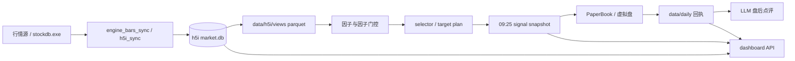
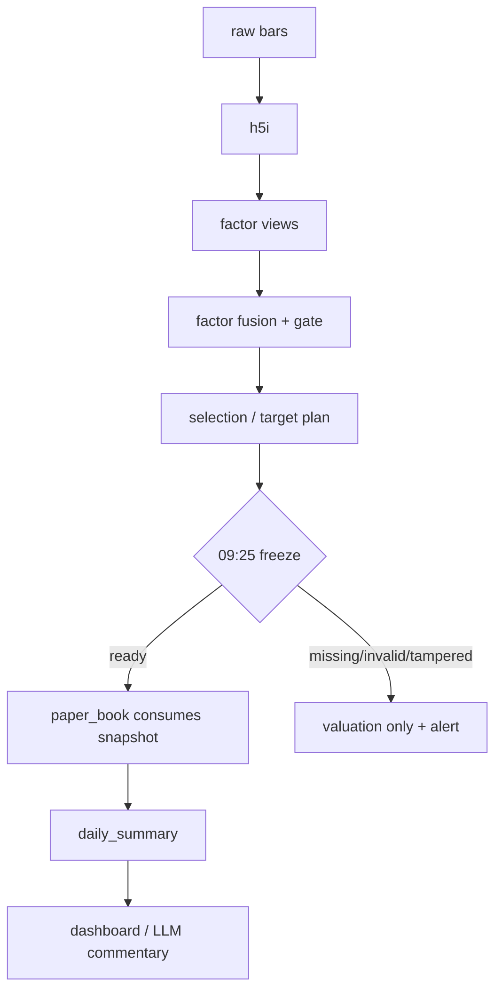

# 架构与数据流补充图

`docs/architecture.md` 当前存在用户未提交改动，本文件独立补充运行时和数据流图，
避免覆盖已有编辑。

## 运行时架构

```mermaid
flowchart LR
    RAW[行情源 / stockdb.exe] --> SYNC[engine_bars_sync / h5i_sync]
    SYNC --> H5I[(h5i market.db)]
    H5I --> VIEWS[data/h5i/views parquet]
    VIEWS --> FACTOR[因子与因子门控]
    FACTOR --> SELECTOR[selector / target plan]
    SELECTOR --> SNAP[09:25 signal snapshot]
    SNAP --> PAPER[PaperBook / 虚拟盘]
    H5I --> DASH[dashboard API]
    SNAP --> DASH
    PAPER --> DAILY[data/daily 回执]
    DAILY --> LLM[LLM 盘后点评]
    DAILY --> DASH
```

## 关键数据流

```mermaid
flowchart TD
    A[raw bars] --> B[h5i]
    B --> C[factor views]
    C --> D[factor fusion + gate]
    D --> E[selection / target plan]
    E --> F{09:25 freeze}
    F -->|ready| G[paper_book consumes snapshot]
    F -->|missing/invalid/tampered| H[valuation only + alert]
    G --> I[daily_summary]
    I --> J[dashboard / LLM commentary]
```

冻结快照是 09:25 后的权威决策输入；`selection.json` 和迟到候选是审计/审核材料，
不能绕过快照直接触发自动交易。
